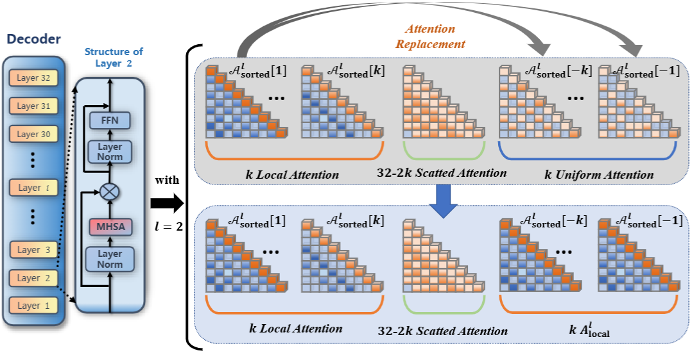

# ART: Attention Replacement Technique to Improve Factuality in LLMs
The repository of the paper *ART: Attention Replacement Technique to Improve Factuality in LLMs*.
Detailed source code and prompt templates are available here.

---
# ART operation
<p align="center">
    <br>
    
      <figcaption style="text-align: center;"> Demonstration for Attention Replacement Technique. </figcaption>
    <br>
</p>


---
# Code
`modify_attention.py` corresponds to the operations that calculate $m$-index described in the Section 3.2 in the paper.

`modeling_llama_head_modified.py`, `modeling_mistral_head_modified.py`, and `modeling_qwen_head_modified.py` are all based on the minor modification on the HuggingFace source code [`modeling_llama`](https://github.com/huggingface/transformers/blob/v4.48.2/src/transformers/models/llama/modeling_llama.py#L482), [`modeling_mistral`](https://github.com/huggingface/transformers/blob/v4.48.2/src/transformers/models/mistral/modeling_mistral.py#L454), and [`modeling_qwen`](https://github.com/huggingface/transformers/blob/v4.48.2/src/transformers/models/qwen2/modeling_qwen2.py#L467).

---
# Prompt templates

Prompt templates for Multi-Choice Question (MCQ) task. (TruthfulQA)

```
You are a problem solver. There is a question with related options provided. You need to think step-by-step to infer the correct choice

Question: {question}

Options:
{options}


Your response should end with 'The answer is: (X)' with X being your chosen option.
```

Prompt templates for MCQ with context for reference. (LogiQA)
```
You are a problem solver. There is a question with related context and options provided. You need to think step-by-step to infer the correct choice.

Context:
{context}

Question: {question}

Options:
{options}


Your response should end with 'The answer is: (X)' with X being your chosen option.
```

Prompt templates for Math Word Problem. (GSM8K)
```
You are a problem solver. There is a math-word problem you need to solve.
This is the question for you: {question}

Your response should end with 'The answer is: X' with X being the numerical result. Think step-by-step to infer the correct answer.
```

